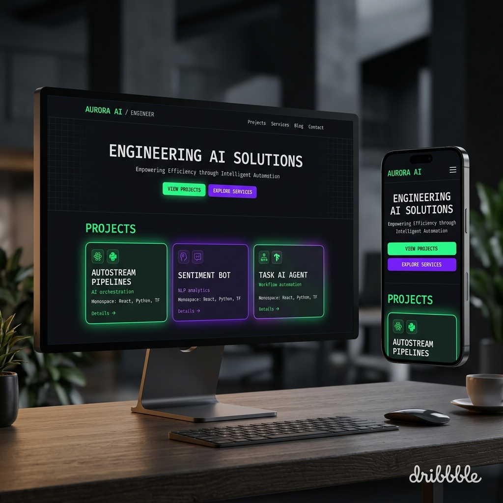

# Abdul Razzak Ghouri - Portfolio

Welcome to my personal portfolio designed and developed to showcase my expertise as an AI Automation Engineer and Full Stack Developer. The site features a clean, minimal aesthetic with a cinematic 3D touch. 



## 📌 Features

- **Responsive Design**: Flawless experience across desktop, tablet, and mobile.
- **Dark Minimalist Theme**: Tech-inspired ui with glowing neon accents.
- **Automated Workflow Showcase**: Comprehensive project case-studies reflecting real deployed AI SaaS tools, automated lead generations, and customer agents.
- **Interactive UI**: Dynamic glassmorphism elements, CSS gradients, dynamic filtering, and interactive animations.

## 🛠️ Tech Stack

### Frameworks & Libraries
- **Astro** - High-performance static site generation
- **React** - Interactive UI components
- **Tailwind CSS** - Rapid utility-first styling
- **Figma** / **Canva** - UI / UX wireframing

## 🚀 Getting Started

If you'd like to inspect the code locally:

1. Clone the repository:
   ```bash
   git clone https://github.com/abdulrazzak10/Abdul-Razzak-Portfolio.git
   ```

2. Install dependencies:
   ```bash
   npm install
   ```

3. Run the development server:
   ```bash
   npm run dev
   ```

4. View locally:
   Open [http://localhost:4321](http://localhost:4321) in your browser.

## 📫 Connect with me

- **LinkedIn**: [linkedin.com/in/abdulrazzakghouri](https://linkedin.com/in/abdulrazzakghouri)
- **GitHub**: [github.com/abdulrazzak10](https://github.com/abdulrazzak10)
- **Email**: iamabdulrazzakghouri@gmail.com

---

© 2026 Abdul Razzak Ghouri. All rights reserved.
